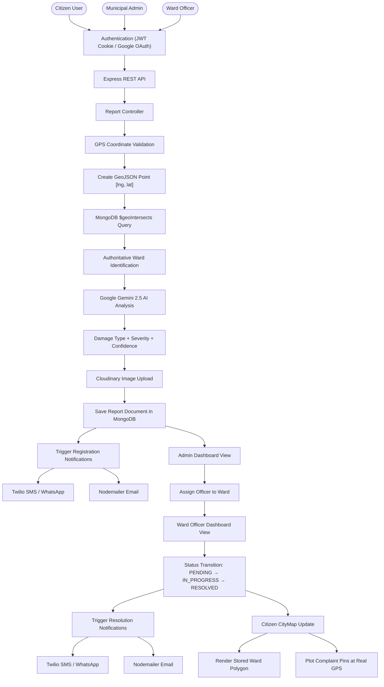
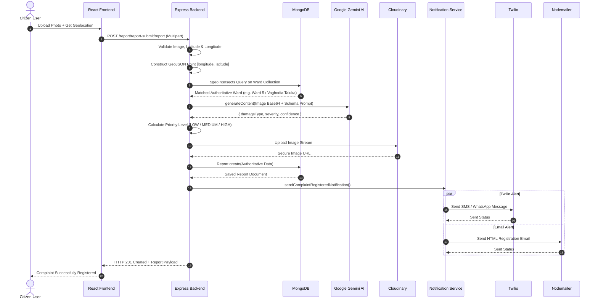

# Faultline AI — AI-Powered Civic Issue Reporting Platform

> A production-grade, role-based civic management system connecting Citizens, Municipal Admins, and Ward Officers through real-time GPS geospatial ward mapping, automated Google Gemini AI damage assessment, Cloudinary image storage, and non-blocking multi-channel notifications (Twilio + Nodemailer).

---

## Table of Contents
- [Project Overview](#project-overview)
- [Core Features](#core-features)
- [Technology Stack](#technology-stack)
- [System Architecture](#system-architecture)
- [Complete System Flow](#complete-system-flow)
- [Complaint Registration & AI Pipeline](#complaint-registration--ai-pipeline)
- [Geospatial & Ward Architecture](#geospatial--ward-architecture)
- [Authentication & Access Control](#authentication--access-control)
- [Notification Architecture](#notification-architecture)
- [Complaint Lifecycle & Workflow](#complaint-lifecycle--workflow)
- [Map Systems Architecture](#map-systems-architecture)
- [Database Architecture & Schemas](#database-architecture--schemas)
- [API Reference](#api-reference)
- [Project Structure](#project-structure)
- [Environment Variables](#environment-variables)
- [Local Development Setup](#local-development-setup)
- [Build & Deployment](#build--deployment)
- [Security & Known Considerations](#security--known-considerations)
- [Data Sources](#data-sources)
- [Technical Decisions & Rationale](#technical-decisions--rationale)
- [How to Explain This Project in an Interview](#how-to-explain-this-project-in-an-interview)
- [Future Roadmap](#future-roadmap)

---

## Project Overview

**Faultline AI** is designed to solve a critical civic problem: citizens encounter infrastructure degradation (potholes, garbage accumulation, street light outages, water leakage), but reporting, ward determination, officer allocation, status tracking, and verification are often disconnected and inefficient.

Faultline AI closes this loop by establishing an end-to-end automated workflow:

```
Citizen GPS → GeoJSON Point → MongoDB $geoIntersects → Authoritative Ward
    ↓
Google Gemini AI Image Analysis → Severity/Priority Scoring
    ↓
Cloudinary Image Storage → MongoDB Complaint Record
    ↓
Multi-Channel Notification (Twilio SMS/WhatsApp + Nodemailer Email)
    ↓
Admin Assignment → Ward Officer Dashboard → Resolution → Citizen Verification
```

---

## Core Features

### 👤 Citizen / User
- **Account Registration & Authentication**: Email/Password sign up and JWT HTTP-only cookie authentication.
- **Google OAuth (Citizen-Only)**: Instant one-click Google authentication powered by Firebase Auth.
- **AI-Assisted Issue Reporting**: Upload infrastructure photos with browser GPS coordinates.
- **Automatic Ward Resolution**: Backend determines the municipal ward via spatial polygon intersection (`$geoIntersects`).
- **Real-Time Status Tracking**: Monitor complaint progress (`PENDING` → `IN_PROGRESS` → `RESOLVED`).
- **Interactive Citizen CityMap**:
  - Displays authoritative stored MongoDB GeoJSON ward boundary.
  - Plots exact complaint markers using actual report GPS coordinates.
  - Filter by category, status, or severity.
  - Integrated "Detect My Location" physical positioning.
- **Automated Notifications**: Receive registration and resolution confirmations via SMS/WhatsApp and Email.

### 🛡️ Municipal Admin
- **Global Operations Dashboard**: View all reported infrastructure issues across the municipality.
- **Ward Metrics & Summaries**: Monitor total, pending, in-progress, and resolved complaint counts per ward.
- **Ward Officer Assignment**: Assign and reallocate officers to specific municipal wards.
- **Interactive Admin Map**: Renders all official municipal ward polygons with issue hotspot markers.
- **Report Lifecycle Management**: Update report statuses and remove invalid entries.

### 👷 Ward Officer
- **Ward-Filtered Dashboard**: Access complaints exclusively belonging to their assigned ward.
- **Interactive Ward Officer Map**: Visualizes assigned ward boundaries and localized complaint pins.
- **Status Workflow Execution**: Transition issue status from `PENDING` to `IN_PROGRESS` and `RESOLVED`.
- **Automated Citizen Notification Trigger**: Status transitions to `RESOLVED` automatically trigger multi-channel citizen alerts.

---

## Technology Stack

| Layer | Technologies Used |
|---|---|
| **Frontend Tier** | React.js (v19), Vite (v7), Tailwind CSS (v4), Framer Motion, Lucide React, Redux Toolkit |
| **Mapping & GIS** | React-Leaflet, Leaflet, OpenStreetMap Tiles, GeoJSON Standard (RFC 7946) |
| **Backend Tier** | Node.js, Express.js (REST API) |
| **Database & ODM** | MongoDB (v8), Mongoose ODM with `2dsphere` Geospatial Indexing |
| **Authentication** | JWT (JSON Web Tokens), HTTP-Only Lax Cookies, Firebase Auth (Google OAuth) |
| **Artificial Intelligence** | Google Gemini AI (`@google/genai` v1.43) |
| **Media Storage** | Cloudinary (v2 SDK) |
| **Notifications** | Twilio SDK (SMS & WhatsApp), Nodemailer (Gmail SMTP) |
| **Development Tools** | dotenv, Multer, Axios |

---

## System Architecture

```
┌────────────────────────────────────────────────────────────────────────┐
│                             CLIENT TIER                                │
│                                                                        │
│   ┌────────────────────────────────────────────────────────────────┐   │
│   │                 React Single Page Application                  │   │
│   │  (Redux Toolkit / Tailwind CSS / Framer Motion / Lucide Icons) │   │
│   └──────┬─────────────────────────┬──────────────────────┬────────┘   │
│          │                         │                      │            │
│          ▼                         ▼                      ▼            │
│   Authentication UI          React-Leaflet           Axios REST        │
│   (SignIn / SignUp)          Interactive Maps        API Client        │
└──────────┼─────────────────────────┼──────────────────────┼────────────┘
           │                         │                      │
           │                         │ HTTP / Cookie        │
           ▼                         ▼                      ▼
┌────────────────────────────────────────────────────────────────────────┐
│                            APPLICATION TIER                            │
│                                                                        │
│   ┌────────────────────────────────────────────────────────────────┐   │
│   │                    Node.js + Express REST API                  │   │
│   └──────┬─────────────────────────┬──────────────────────┬────────┘   │
│          │                         │                      │            │
│          ▼                         ▼                      ▼            │
│   JWT Auth Cookie          Role Middleware          Express Routers    │
│   (isAuth)                 (isAdmin / isOfficer)    (Auth/Report/Admin)│
│          │                         │                      │            │
│          └─────────────────────────┼──────────────────────┘            │
│                                    ▼                                   │
│                          Controllers & Services                        │
│             (reportController, adminController, notificationService)   │
└──────────┬─────────────────────────┬──────────────────────┬────────────┘
           │                         │                      │
           ▼                         ▼                      ▼
┌──────────────────────┐  ┌──────────────────────┐  ┌────────────────────┐
│    DATABASE TIER     │  │     EXTERNAL AI      │  │   NOTIFICATION &   │
│                      │  │       SERVICES       │  │   MEDIA SERVICES   │
│   MongoDB Instance   │  │                      │  │                    │
│ ├─ User Collection   │  │  Google Gemini AI    │  │  Cloudinary Media  │
│ ├─ Report Collection │  │  (Damage & Severity) │  │  Twilio SMS/WA     │
│ ├─ Ward Collection   │  └──────────────────────┘  │  Nodemailer Email  │
│ └─ WardOfficer Coll. │                            └────────────────────┘
└──────────────────────┘
```

---

## Complete System Flow



---

## Complaint Registration & AI Pipeline

The complaint registration flow is **backend-authoritative**. The client frontend cannot spoof or manually select the municipal ward.



### AI Analysis Specification (Google Gemini)
- **Model**: `gemini-2.5-flash`
- **Output Schema**: JSON Object containing `damageType`, `severity` (1-10 scale), and `confidence` (0.0 - 1.0).
- **Supported Issue Types**: `POTHOLE`, `ROAD_CRACK`, `GARBAGE`, `STREETLIGHT`, `WATER_LEAK`, `OTHER`.
- **Priority Matrix**:
  - `HIGH`: Severity $\ge 7$ or Issue Type = `POTHOLE` / `WATER_LEAK` with high confidence.
  - `MEDIUM`: Severity $4 - 6$.
  - `LOW`: Severity $\le 3$.

---

## Geospatial & Ward Architecture

### 1. The GeoJSON Standard vs Leaflet Coordinate Convention
Crucial GIS distinction enforced across the codebase:
- **MongoDB GeoJSON / RFC 7946 Standard**: `[longitude, latitude]` order.
- **Leaflet Map Rendering Standard**: `[latitude, longitude]` order.

The backend performs spatial operations strictly using `[longitude, latitude]`. The utility `geojsonToLatLngs()` converts coordinates to `[latitude, longitude]` when passing arrays to Leaflet map components.

### 2. MongoDB `$geoIntersects` Spatial Lookup
Every `Ward` document in MongoDB maintains a GeoJSON `geometry` field (`Polygon` or `MultiPolygon`) with a 2D Sphere Index (`2dsphere`).

```javascript
// Spatial query executed inside createReport controller:
const matchedWard = await Ward.findOne({
  geometry: {
    $geoIntersects: {
      $geometry: {
        type: 'Point',
        coordinates: [longitude, latitude] // [lng, lat]
      }
    }
  }
})
```

---

## Authentication & Access Control

Authentication uses **JSON Web Tokens (JWT)** delivered via **HTTP-only cookies** (`token`).

```
Login Request → Credentials Verified → JWT Generated → Set-Cookie: token (HTTP-Only)
                                                               │
Authenticated Request ← Request Header Cookie ← Browser Stores Cookie
       │
isAuth Middleware → Verifies Token → Attaches req.userId → Access Granted
```

### Role-Based Access Control (RBAC) Matrix

| Endpoint Group | Citizen (`user`) | Ward Officer (`officer`) | Municipal Admin (`admin`) |
|---|:---:|:---:|:---:|
| `POST /api/auth/google-auth` | ✅ | ❌ | ❌ |
| `POST /report/report-submit/report` | ✅ | ❌ | ❌ |
| `GET /report/report-submit/reports` | ✅ (Own Reports) | ❌ | ❌ |
| `GET /api/admin/wards` | ✅ (Read-Only) | ✅ (Read-Only) | ✅ (Read-Only) |
| `GET /api/admin/officer/reports` | ❌ | ✅ (Assigned Ward) | ✅ |
| `PATCH /api/admin/officer/reports/:id/status` | ❌ | ✅ (Assigned Ward) | ✅ |
| `GET /api/admin/reports` | ❌ | ❌ | ✅ (All Wards) |
| `POST /api/admin/ward-officer` | ❌ | ❌ | ✅ |
| `GET /api/admin/users` | ❌ | ❌ | ✅ |

> [!IMPORTANT]
> **Google OAuth Restriction**: Google Authentication (via Firebase Auth) is strictly restricted to **Citizen/User** registration and login. Admins and Ward Officers must authenticate via dedicated credential routes.

---

## Notification Architecture

Notifications are managed by a **Centralized Non-Blocking Notification Service** ([`backend/utils/notificationService.js`](file:///d:/FaultLine-changed/backend/utils/notificationService.js)).

```
                  ┌──────────────────────────────────────────────┐
                  │    Centralized Notification Service          │
                  │   (sendComplaintRegisteredNotification /     │
                  │    sendComplaintResolvedNotification)        │
                  └──────────────┬────────────────┬──────────────┘
                                 │                │
                        (Async Non-Blocking)  (Async Non-Blocking)
                                 │                │
                                 ▼                ▼
                      ┌──────────────────┐  ┌──────────────────┐
                      │    Twilio SDK    │  │    Nodemailer    │
                      │ (SMS & WhatsApp) │  │   (Gmail SMTP)   │
                      └────────┬─────────┘  └────────┬─────────┘
                               │                     │
                               ▼                     ▼
                      ┌────────────────────────────────────────┐
                      │            Citizen Recipient           │
                      └────────────────────────────────────────┘
```

- **Non-Blocking Safety**: All notification attempts use `.catch(...)` error handlers. Twilio or SMTP network errors **never** fail complaint creation or status updates.

---

## Complaint Lifecycle & Workflow

```
┌───────────┐         Ward Officer / Admin           ┌──────────────┐
│  PENDING  │ ─────────────────────────────────────> │ IN_PROGRESS  │
└───────────┘                                        └──────┬───────┘
                                                            │
                                                     Resolves Issue
                                                            │
                                                            ▼
                                                     ┌──────────────┐
                                                     │   RESOLVED   │
                                                     └──────┬───────┘
                                                            │
                                             Triggers Resolution Alerts
                                            (Twilio + Nodemailer Email)
```

---

## Map Systems Architecture

### 1. Citizen CityMap ([`CityMap.jsx`](file:///d:/FaultLine-changed/frontend/src/pages/CityMap.jsx))
- **Ward Boundary**: Fetches stored GeoJSON polygon for the user's ward (`report.location.ward`) from `GET /api/admin/wards` and renders a `<Polygon />`.
- **Complaint Pins**: Places `<Marker />` elements at the complaint's actual GPS coordinates (`latitude`, `longitude`).
- **Filters**: Category (`detectedType`), Status (`status`), and Severity (`priorityLevel`).

### 2. Admin Map ([`AdminMap.jsx`](file:///d:/FaultLine-changed/frontend/src/pages/AdminMap.jsx))
- **Sidebar List**: Displays **all 12 official VMC municipal wards** (plus Test Ward #99), displaying exact complaint metrics per ward (even when total complaints = 0).
- **Ward Highlighting**: Renders stored MongoDB GeoJSON geometries and fits map bounds upon ward selection.

### 3. Ward Officer Map ([`OfficerMap.jsx`](file:///d:/FaultLine-changed/frontend/src/pages/OfficerMap.jsx))
- **Assigned Ward View**: Renders the stored GeoJSON boundary for `user.assignedWard` and auto-fits map bounds.
- **Localized Issues**: Displays markers for all complaints belonging to the officer's ward.

---

## Database Architecture & Schemas

```
┌─────────────────────────┐          1:N           ┌──────────────────────────┐
│          User           │ ─────────────────────> │          Report          │
├─────────────────────────┤                        ├──────────────────────────┤
│ _id: ObjectId          │                        │ _id: ObjectId            │
│ name: String            │                        │ reportedBy: Ref(User)    │
│ email: String (Unique)  │                        │ imageUrl: String         │
│ password: String        │                        │ location.latitude: Num   │
│ role: Enum              │                        │ location.longitude: Num  │
│ assignedWard: String    │                        │ location.address: String │
└─────────────────────────┘                        │ location.ward: String    │
                                                   │ aiAnalysis.detectedType  │
                                                   │ priorityLevel: Enum      │
                                                   │ status: Enum             │
                                                   └──────────────────────────┘

┌─────────────────────────┐          1:1           ┌──────────────────────────┐
│          Ward           │ ─────────────────────> │       WardOfficer        │
├─────────────────────────┤                        ├──────────────────────────┤
│ _id: ObjectId          │                        │ _id: ObjectId            │
│ wardNumber: Number (Unq)│                        │ officer: Ref(User)       │
│ wardName: String        │                        │ ward: String (Unique)    │
│ geometry: GeoJSON       │                        └──────────────────────────┘
│ (2dsphere Index)        │
└─────────────────────────┘
```

---

## API Reference

### Authentication APIs (`/api/auth`)
- `POST /api/auth/signup`: Register a new citizen account.
- `POST /api/auth/signin`: Authenticate citizen, officer, or admin credentials.
- `POST /api/auth/google-auth`: Authenticate/register citizen via Google OAuth token payload.
- `POST /api/auth/signout`: Clear HTTP-only authentication cookie.
- `POST /api/auth/send-otp`: Trigger password reset OTP email.
- `POST /api/auth/verify-otp`: Validate 6-digit OTP code.
- `POST /api/auth/reset-password`: Reset user password.

### Report APIs (`/report/report-submit`)
- `POST /report/report-submit/report`: Create a new civic issue report (Multipart image + GPS).
- `GET /report/report-submit/reports`: Fetch authenticated user's submitted reports.

### Admin & Officer APIs (`/api/admin`)
- `GET /api/admin/wards`: Fetch all stored municipal ward documents with GeoJSON geometries (Read-only, `isAuth`).
- `GET /api/admin/reports`: Fetch all complaints across all wards (Admin only).
- `PATCH /api/admin/reports/:id/status`: Update complaint status (Admin/Officer).
- `GET /api/admin/ward-summary`: Summary metrics grouped by municipal ward (Admin only).
- `POST /api/admin/ward-officer`: Map an officer to a ward (Admin only).
- `GET /api/admin/officer/reports`: Fetch complaints for officer's assigned ward (Admin/Officer).

---

## Project Structure

```
Faultline-AI/
├── frontend/
│   ├── src/
│   │   ├── components/
│   │   │   └── Navbar.jsx
│   │   ├── pages/
│   │   │   ├── AdminIssues.jsx
│   │   │   ├── AdminMap.jsx
│   │   │   ├── CityMap.jsx
│   │   │   ├── ForgetPassword.jsx
│   │   │   ├── Home.jsx
│   │   │   ├── OfficerIssues.jsx
│   │   │   ├── OfficerMap.jsx
│   │   │   ├── Report.jsx
│   │   │   ├── SignIn.jsx
│   │   │   ├── SignUp.jsx
│   │   │   └── TrackStatus.jsx
│   │   ├── redux/
│   │   │   ├── store.js
│   │   │   └── userSlice.js
│   │   ├── utils/
│   │   │   └── wardPolygon.js
│   │   ├── App.jsx
│   │   └── firebase.js
│   ├── package.json
│   └── vite.config.js
│
├── backend/
│   ├── config/
│   │   ├── db.js
│   │   └── seedWards.js
│   ├── controllers/
│   │   ├── adminController.js
│   │   ├── authController.js
│   │   └── reportController.js
│   ├── middleware/
│   │   ├── isAdmin.js
│   │   ├── isAuth.js
│   │   └── multer.js
│   ├── model/
│   │   ├── Report.js
│   │   ├── User.js
│   │   ├── Ward.js
│   │   └── WardOfficer.js
│   ├── routes/
│   │   ├── adminRoute.js
│   │   ├── authRoute.js
│   │   ├── reportRoute.js
│   │   └── userRoute.js
│   ├── utils/
│   │   ├── cloudinary.js
│   │   ├── nodemailer.js
│   │   ├── notificationService.js
│   │   └── twillio.js
│   ├── index.js
│   └── package.json
│
└── README.md
```

---

## Environment Variables

Create a `.env` file in the `backend/` directory:

```env
# Server & Database Configuration
PORT=8000
MONGODB_URI=mongodb://127.0.0.1:27017/faultlineAi
JWT_SECRET=your_super_secret_jwt_key

# Artificial Intelligence (Google Gemini)
GEMINI_API_KEY=your_google_gemini_api_key

# Media Storage (Cloudinary)
MY_CLOUD_NAME=your_cloudinary_cloud_name
MY_API_KEY=your_cloudinary_api_key
MY_CLOUD_SECRET=your_cloudinary_api_secret

# Multi-Channel Notifications
EMAIL=your_gmail_address@gmail.com
PASS=your_gmail_app_password

TWILIO_ACCOUNT_SID=your_twilio_account_sid
TWILIO_AUTH_TOKEN=your_twilio_auth_token
TWILIO_PHONE_NUMBER=your_twilio_phone_number
```

---

## Local Development Setup

### 1. Prerequisites
- Node.js (v18+)
- MongoDB Community Server running locally or a MongoDB Atlas URI

### 2. Backend Setup
```bash
cd backend
npm install
# Configure backend/.env file
npm start
```
*The backend connects to MongoDB and automatically seeds the 12 official VMC municipal ward polygons + Test Ward #99 on startup.*

### 3. Frontend Setup
```bash
cd frontend
npm install
npm run dev
```
*Access the application in your browser at `http://localhost:5173`.*

---

## Build & Deployment

### Production Build Verification
```bash
cd frontend
npm run build
```
- **Build Output**: `frontend/dist/`
- **Compiler**: Vite v7
- **Verification**: Zero compilation errors.

---

## Security & Known Considerations

1. **HTTP-Only Cookies**: JWT tokens are transmitted via HTTP-only, `sameSite: 'lax'` cookies to mitigate Cross-Site Scripting (XSS) risks.
2. **Server-Side Ward Verification**: Ward determination is performed via `$geoIntersects` spatial queries on the backend to prevent client-side coordinate spoofing.
3. **Transient AI Rate Limits**: In case of temporary Google Cloud Gemini 503 overload spikes, backend controllers capture API exceptions cleanly without crashing the server.

---

## Data Sources

- **Vadodara Administrative Ward Boundaries**: Derived from the open-source **BharatAtlas / DataMeet** Vadodara Ward Map dataset (`https://bharatlas.com/view/wards_vadodara`), under CC-BY-4.0.

---

## Technical Decisions & Rationale

- **Why MongoDB `$geoIntersects`?** Allows instant 2D sphere spatial evaluation of `Point` coordinates against complex multi-vertex polygons.
- **Why Non-Blocking Notifications?** Ensures that third-party SMS or email gateway latencies never slow down or fail core database transactions.
- **Why Cloudinary for Images?** Offloads binary file handling from Node.js servers and provides CDN delivery for fast client rendering.

---

## How to Explain This Project in an Interview

> *"Faultline AI is a role-based civic management platform built with React, Node.js, Express, and MongoDB. The core technical achievement is its backend-authoritative geospatial engine: when a citizen submits an issue with GPS coordinates, MongoDB uses a 2dsphere $geoIntersects query to map the coordinates against stored GeoJSON ward polygons to determine the municipal ward. Uploaded photos are processed asynchronously by Google Gemini AI to analyze issue type and severity score. The workflow manages issue resolution across Municipal Admin and Ward Officer dashboards, sending real-time SMS and email notifications to citizens upon registration and resolution."*

---

## Future Roadmap

- [ ] Automated duplicate complaint detection within spatial radius ($100\text{m}$).
- [ ] Citizen upvoting & endorsement system for high-priority issues.
- [ ] Real-time WebSocket notifications for ward officers.
- [ ] Public civic performance analytics dashboard.

---

### License & Attribution
Maintained by **Ravindra Prajapat** — [faultline-ai Repository](https://github.com/Ravindraprajapat/faultline-ai).
