# Faultline AI — AI-Powered Civic Issue Reporting Platform

> A production-grade, role-based civic management system connecting Citizens, Municipal Admins, and Ward Officers through real-time GPS geospatial ward mapping, automated Google Gemini AI damage assessment, Cloudinary image storage, and non-blocking multi-channel notifications (Twilio + Nodemailer).

---

## Table of Contents
- [Project Overview](#project-overview)
- [Core Features](#core-features)
- [Technology Stack](#technology-stack)
- [System Architecture](#system-architecture)
- [Complete System Flow](#complete-system-flow)
- [Complaint Registration Flow](#complaint-registration-flow)
- [Complaint Registration Sequence](#complaint-registration-sequence)
- [GPS → Ward → Officer Flow](#gps--ward--officer-flow)
- [Admin Workflow](#admin-workflow)
- [Ward Officer Workflow](#ward-officer-workflow)
- [Complaint Resolution Flow](#complaint-resolution-flow)
- [Complaint Resolution Sequence](#complaint-resolution-sequence)
- [Citizen CityMap Flow](#citizen-citymap-flow)
- [Authentication Flow](#authentication-flow)
- [Google Authentication Flow](#google-authentication-flow)
- [Image Upload Flow](#image-upload-flow)
- [Database Architecture & ER Diagram](#database-architecture--er-diagram)
- [Ward & Geospatial Architecture](#ward--geospatial-architecture)
- [Notification Architecture](#notification-architecture)
- [API Architecture](#api-architecture)
- [Frontend Architecture](#frontend-architecture)
- [Security & Authorization Flow](#security--authorization-flow)
- [Complete End-to-End Sequence](#complete-end-to-end-sequence)
- [API Reference](#api-reference)
- [Project Structure](#project-structure)
- [Environment Variables](#environment-variables)
- [Local Development Setup](#local-development-setup)
- [Build & Deployment](#build--deployment)
- [Important Design Decisions](#important-design-decisions)
- [Data Sources](#data-sources)
- [How to Explain This Project in an Interview](#how-to-explain-this-project-in-an-interview)
- [Future Improvements](#future-improvements)

---

## Project Overview

**Faultline AI** is designed to solve a common civic problem: citizens encounter infrastructure degradation (potholes, garbage accumulation, streetlight outages, water leakage), but reporting, ward determination, officer allocation, status tracking, and resolution verification are often disconnected.

Faultline AI creates a single automated workflow where:
1. A citizen submits an infrastructure complaint photo with GPS coordinates.
2. The backend converts GPS coordinates into a GeoJSON `Point`.
3. MongoDB `$geoIntersects` spatial query determines the authoritative municipal ward.
4. Google Gemini AI analyzes the uploaded image to classify issue type, severity, and priority.
5. The image is stored securely on Cloudinary.
6. The complaint is saved in MongoDB and routed to the assigned Ward Officer.
7. Asynchronous notifications (Twilio SMS/WhatsApp + Nodemailer Email) alert citizens upon registration and resolution.
8. Citizens visualize their ward boundary and complaint markers on the interactive **CityMap**.

---

## Core Features

### 👤 Citizen / User
- **Account Registration & Login**: Credentials-based sign up with JWT HTTP-only cookies.
- **Google Authentication**: Instant one-click Google Login powered by Firebase Auth (restricted to Citizens).
- **AI-Based Issue Reporting**: Submit infrastructure photos with browser GPS location.
- **Automatic Backend Ward Detection**: Backend spatial polygon intersection (`$geoIntersects`) determines responsible ward.
- **Gemini AI Damage Analysis**: Automated damage type classification, severity scoring (1-10), and priority mapping.
- **Real-Time Status Tracking**: Monitor complaint progress (`PENDING` → `IN_PROGRESS` → `RESOLVED`).
- **Interactive Citizen CityMap**: Renders stored MongoDB GeoJSON ward boundary and plots real report GPS markers.
- **Automated Notifications**: Non-blocking registration and resolution alerts via SMS/WhatsApp and Email.

### 🛡️ Municipal Admin
- **Global Operations Dashboard**: View all reported infrastructure complaints across the municipality.
- **Ward Summaries**: Track total, pending, in-progress, and resolved metrics per ward.
- **Ward Officer Assignment**: Assign and manage officers mapped to specific municipal wards.
- **Interactive Admin Map**: Renders all official municipal ward polygons with complaint markers.

### 👷 Ward Officer
- **Ward-Filtered Dashboard**: Access complaints exclusively belonging to their assigned ward.
- **Interactive Officer Map**: Visualizes assigned ward boundaries and localized complaint pins.
- **Status Workflow Execution**: Update complaint status from `PENDING` to `IN_PROGRESS` and `RESOLVED`.
- **Automated Resolution Trigger**: Marking an issue as `RESOLVED` automatically fires citizen notifications.

---

## Technology Stack

| Layer | Technology Used |
|---|---|
| **Frontend** | React.js (v19), Tailwind CSS (v4), Framer Motion, Lucide React, Redux Toolkit |
| **Maps & GIS** | React-Leaflet, Leaflet, OpenStreetMap Tiles, GeoJSON Standard (RFC 7946) |
| **Backend** | Node.js, Express.js (REST API) |
| **Database & ODM** | MongoDB (v8), Mongoose ODM with `2dsphere` Geospatial Indexing |
| **Authentication** | JWT (JSON Web Tokens), HTTP-Only Lax Cookies, Firebase Auth (Google OAuth) |
| **Artificial Intelligence** | Google Gemini AI (`@google/genai` v1.43) |
| **Media Storage** | Cloudinary (v2 SDK) |
| **Notifications** | Twilio SDK (SMS & WhatsApp), Nodemailer (Gmail SMTP) |
| **Dev Tools** | dotenv, Multer, Axios |

---

## System Architecture

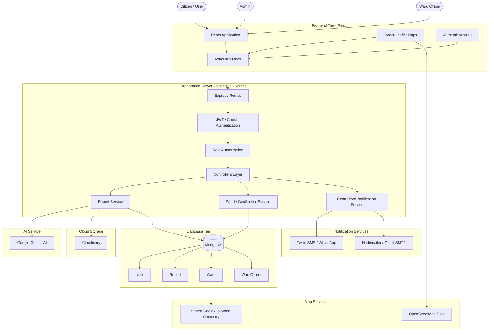
```mermaid
flowchart TD
    USER([Citizen / User])
    ADMIN([Admin])
    OFFICER([Ward Officer])

    subgraph FRONTEND["Frontend Tier - React"]
        UI["React Application"]
        AXIOS["Axios API Layer"]
        MAP["React-Leaflet Maps"]
        AUTH_UI["Authentication UI"]
    end

    subgraph BACKEND["Application Server - Node.js + Express"]
        ROUTES["Express Routes"]
        AUTH["JWT / Cookie Authentication"]
        ROLE["Role Authorization"]
        CONTROLLER["Controllers Layer"]
        REPORT["Report Service"]
        WARD["Ward / GeoSpatial Service"]
        NOTIFY["Centralized Notification Service"]
    end

    subgraph DATABASE["Database Tier"]
        MONGO[("MongoDB")]
        USER_MODEL["User"]
        REPORT_MODEL["Report"]
        WARD_MODEL["Ward"]
        OFFICER_MODEL["WardOfficer"]
    end

    subgraph AI["AI Service"]
        GEMINI["Google Gemini AI"]
    end

    subgraph STORAGE["Cloud Storage"]
        CLOUDINARY["Cloudinary"]
    end

    subgraph NOTIFICATIONS["Notification Services"]
        TWILIO["Twilio SMS / WhatsApp"]
        SMTP["Nodemailer / Gmail SMTP"]
    end

    subgraph MAP_SERVICE["Map Services"]
        OSM["OpenStreetMap Tiles"]
        GEOJSON["Stored GeoJSON Ward Geometry"]
    end

    USER --> UI
    ADMIN --> UI
    OFFICER --> UI

    UI --> AXIOS
    AUTH_UI --> AXIOS
    MAP --> AXIOS

    AXIOS --> ROUTES
    ROUTES --> AUTH
    AUTH --> ROLE
    ROLE --> CONTROLLER

    CONTROLLER --> REPORT
    CONTROLLER --> WARD
    CONTROLLER --> NOTIFY

    REPORT --> GEMINI
    REPORT --> CLOUDINARY
    REPORT --> MONGO

    WARD --> MONGO
    MONGO --> USER_MODEL
    MONGO --> REPORT_MODEL
    MONGO --> WARD_MODEL
    MONGO --> OFFICER_MODEL

    WARD_MODEL --> GEOJSON
    MAP --> OSM

    NOTIFY --> TWILIO
    NOTIFY --> SMTP
```

---

## Complete System Flow

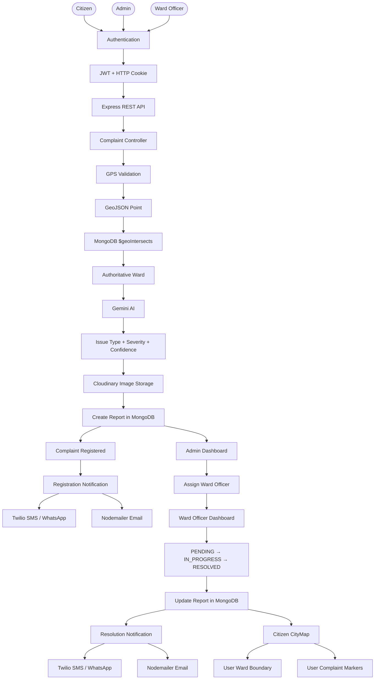
```mermaid
flowchart TD
    CITIZEN([Citizen])
    ADMIN([Admin])
    OFFICER([Ward Officer])

    CITIZEN --> AUTH["Authentication"]
    ADMIN --> AUTH
    OFFICER --> AUTH

    AUTH --> JWT["JWT + HTTP Cookie"]

    JWT --> API["Express REST API"]

    API --> REPORT["Complaint Controller"]

    REPORT --> GPS["GPS Validation"]
    GPS --> GEO["GeoJSON Point"]

    GEO --> SPATIAL["MongoDB $geoIntersects"]
    SPATIAL --> WARD["Authoritative Ward"]

    WARD --> AI["Gemini AI"]
    AI --> ANALYSIS["Issue Type + Severity + Confidence"]

    ANALYSIS --> IMAGE["Cloudinary Image Storage"]

    IMAGE --> SAVE["Create Report in MongoDB"]

    SAVE --> REGISTER["Complaint Registered"]

    REGISTER --> NOTIFY1["Registration Notification"]
    NOTIFY1 --> SMS1["Twilio SMS / WhatsApp"]
    NOTIFY1 --> EMAIL1["Nodemailer Email"]

    SAVE --> ADMIN_PANEL["Admin Dashboard"]

    ADMIN_PANEL --> ASSIGN["Assign Ward Officer"]

    ASSIGN --> OFFICER_PANEL["Ward Officer Dashboard"]

    OFFICER_PANEL --> STATUS["PENDING → IN_PROGRESS → RESOLVED"]

    STATUS --> UPDATE["Update Report in MongoDB"]

    UPDATE --> NOTIFY2["Resolution Notification"]

    NOTIFY2 --> SMS2["Twilio SMS / WhatsApp"]
    NOTIFY2 --> EMAIL2["Nodemailer Email"]

    UPDATE --> CITYMAP["Citizen CityMap"]

    CITYMAP --> USER_WARD["User Ward Boundary"]
    CITYMAP --> USER_REPORTS["User Complaint Markers"]
```

---

## Complaint Registration Flow

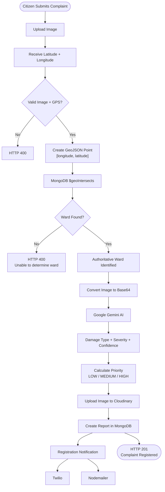
```mermaid
flowchart TD
    START([Citizen Submits Complaint]) --> IMAGE["Upload Image"]
    IMAGE --> GPS["Receive Latitude + Longitude"]

    GPS --> VALIDATE{"Valid Image + GPS?"}

    VALIDATE -- No --> ERROR["HTTP 400"]
    VALIDATE -- Yes --> POINT["Create GeoJSON Point<br/>[longitude, latitude]"]

    POINT --> WARD_QUERY["MongoDB $geoIntersects"]

    WARD_QUERY --> MATCH{"Ward Found?"}

    MATCH -- No --> WARD_ERROR["HTTP 400<br/>Unable to determine ward"]

    MATCH -- Yes --> WARD["Authoritative Ward Identified"]

    WARD --> BASE64["Convert Image to Base64"]

    BASE64 --> GEMINI["Google Gemini AI"]

    GEMINI --> AI_RESULT["Damage Type + Severity + Confidence"]

    AI_RESULT --> PRIORITY["Calculate Priority<br/>LOW / MEDIUM / HIGH"]

    PRIORITY --> CLOUDINARY["Upload Image to Cloudinary"]

    CLOUDINARY --> CREATE["Create Report in MongoDB"]

    CREATE --> NOTIFY["Registration Notification"]

    NOTIFY --> TWILIO["Twilio"]
    NOTIFY --> EMAIL["Nodemailer"]

    CREATE --> SUCCESS([HTTP 201<br/>Complaint Registered])
```

---

## Complaint Registration Sequence

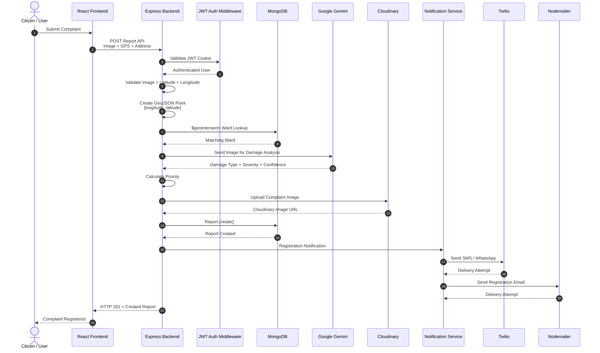
```mermaid
sequenceDiagram
    autonumber

    actor Citizen as Citizen / User
    participant FE as React Frontend
    participant BE as Express Backend
    participant AUTH as JWT Auth Middleware
    participant DB as MongoDB
    participant AI as Google Gemini
    participant CDN as Cloudinary
    participant NS as Notification Service
    participant TW as Twilio
    participant MAIL as Nodemailer

    Citizen->>FE: Submit Complaint
    FE->>BE: POST Report API<br/>Image + GPS + Address

    BE->>AUTH: Validate JWT Cookie
    AUTH-->>BE: Authenticated User

    BE->>BE: Validate Image + Latitude + Longitude

    BE->>BE: Create GeoJSON Point<br/>[longitude, latitude]

    BE->>DB: $geoIntersects Ward Lookup
    DB-->>BE: Matching Ward

    BE->>AI: Send Image for Damage Analysis
    AI-->>BE: Damage Type + Severity + Confidence

    BE->>BE: Calculate Priority

    BE->>CDN: Upload Complaint Image
    CDN-->>BE: Cloudinary Image URL

    BE->>DB: Report.create()
    DB-->>BE: Report Created

    BE->>NS: Registration Notification

    NS->>TW: Send SMS / WhatsApp
    TW-->>NS: Delivery Attempt

    NS->>MAIL: Send Registration Email
    MAIL-->>NS: Delivery Attempt

    BE-->>FE: HTTP 201 + Created Report
    FE-->>Citizen: Complaint Registered
```

---

## GPS → Ward → Officer Flow


```mermaid
flowchart LR
    GPS["Citizen GPS<br/>Latitude + Longitude"]
        --> POINT["GeoJSON Point<br/>[longitude, latitude]"]

    POINT --> MONGO["MongoDB<br/>$geoIntersects"]

    MONGO --> WARD["Authoritative Ward"]

    WARD --> REPORT["Report.location.ward"]

    REPORT --> MAPPING["WardOfficer Mapping"]

    MAPPING --> OFFICER["Assigned Ward Officer"]

    OFFICER --> DASHBOARD["Officer Dashboard"]

    DASHBOARD --> PROCESS["Process Complaint"]

    PROCESS --> RESOLVED["RESOLVED"]

    RESOLVED --> CITIZEN["Citizen Notification"]
```

---

## Admin Workflow

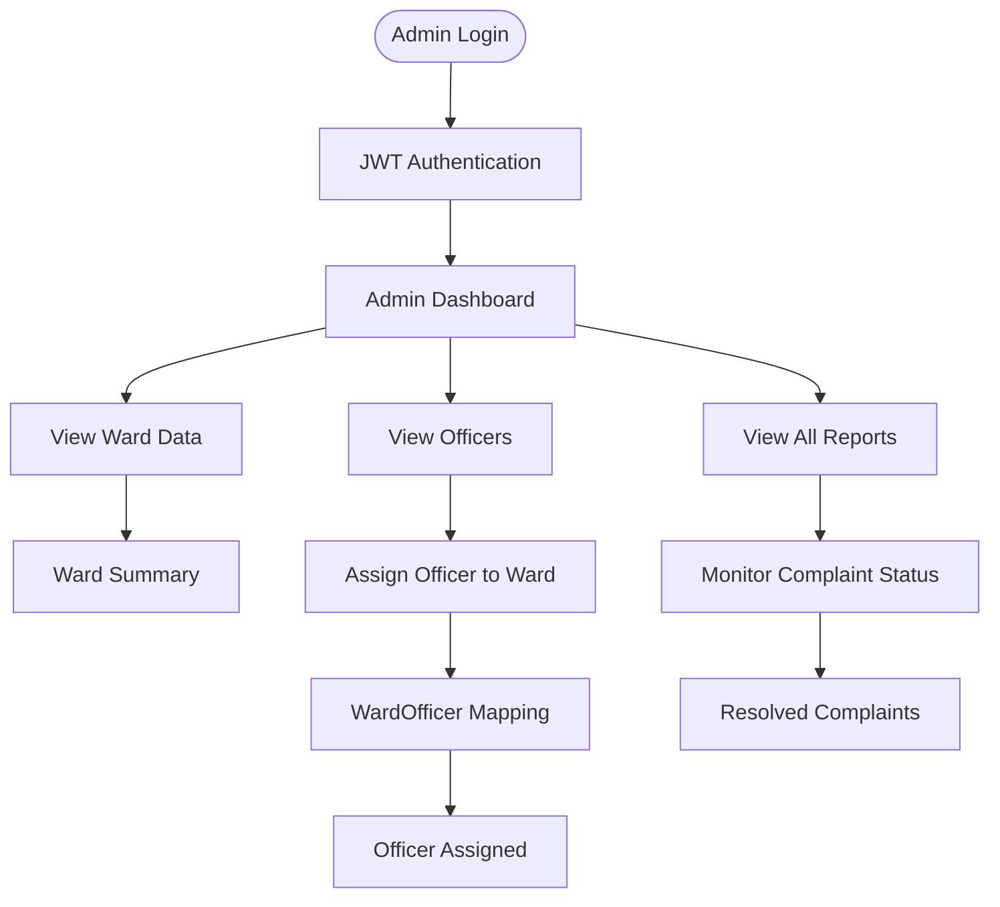
```mermaid
flowchart TD
    ADMIN([Admin Login])
        --> AUTH["JWT Authentication"]

    AUTH --> DASHBOARD["Admin Dashboard"]

    DASHBOARD --> REPORTS["View All Reports"]

    DASHBOARD --> WARDS["View Ward Data"]

    DASHBOARD --> OFFICERS["View Officers"]

    WARDS --> SUMMARY["Ward Summary"]

    OFFICERS --> ASSIGN["Assign Officer to Ward"]

    ASSIGN --> MAPPING["WardOfficer Mapping"]

    MAPPING --> OFFICER["Officer Assigned"]

    REPORTS --> STATUS["Monitor Complaint Status"]

    STATUS --> RESOLVE["Resolved Complaints"]
```

---

## Ward Officer Workflow

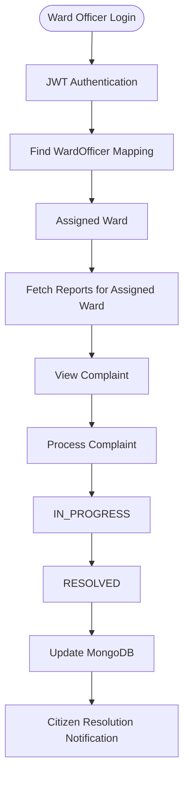
```mermaid
flowchart TD
    OFFICER([Ward Officer Login])
        --> AUTH["JWT Authentication"]

    AUTH --> MAPPING["Find WardOfficer Mapping"]

    MAPPING --> WARD["Assigned Ward"]

    WARD --> REPORTS["Fetch Reports for Assigned Ward"]

    REPORTS --> VIEW["View Complaint"]

    VIEW --> PROCESS["Process Complaint"]

    PROCESS --> IN_PROGRESS["IN_PROGRESS"]

    IN_PROGRESS --> RESOLVE["RESOLVED"]

    RESOLVE --> DB["Update MongoDB"]

    DB --> NOTIFY["Citizen Resolution Notification"]
```

---

## Complaint Resolution Flow

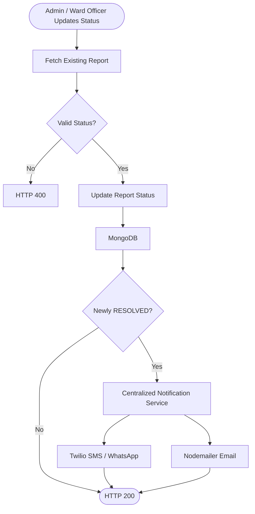
```mermaid
flowchart TD
    START([Admin / Ward Officer Updates Status])
        --> FETCH["Fetch Existing Report"]

    FETCH --> CHECK{"Valid Status?"}

    CHECK -- No --> ERROR["HTTP 400"]

    CHECK -- Yes --> UPDATE["Update Report Status"]

    UPDATE --> DB["MongoDB"]

    DB --> RESOLVED{"Newly RESOLVED?"}

    RESOLVED -- No --> SUCCESS([HTTP 200])

    RESOLVED -- Yes --> SERVICE["Centralized Notification Service"]

    SERVICE --> TWILIO["Twilio SMS / WhatsApp"]
    SERVICE --> EMAIL["Nodemailer Email"]

    TWILIO --> SUCCESS
    EMAIL --> SUCCESS
```

---

## Complaint Resolution Sequence

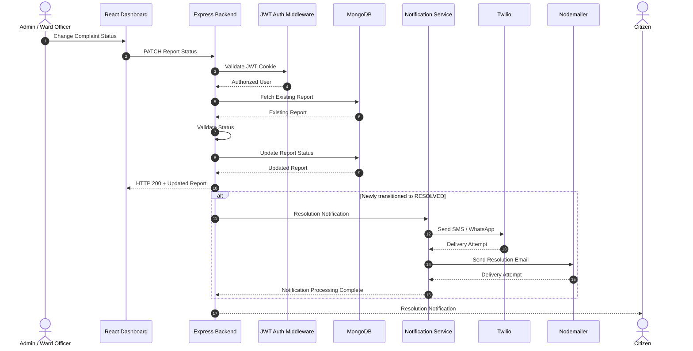
```mermaid
sequenceDiagram
    autonumber

    actor Officer as Admin / Ward Officer
    participant FE as React Dashboard
    participant BE as Express Backend
    participant AUTH as JWT Auth Middleware
    participant DB as MongoDB
    participant NS as Notification Service
    participant TW as Twilio
    participant MAIL as Nodemailer
    actor Citizen as Citizen

    Officer->>FE: Change Complaint Status

    FE->>BE: PATCH Report Status

    BE->>AUTH: Validate JWT Cookie
    AUTH-->>BE: Authorized User

    BE->>DB: Fetch Existing Report
    DB-->>BE: Existing Report

    BE->>BE: Validate Status

    BE->>DB: Update Report Status
    DB-->>BE: Updated Report

    BE-->>FE: HTTP 200 + Updated Report

    alt Newly transitioned to RESOLVED
        BE->>NS: Resolution Notification

        NS->>TW: Send SMS / WhatsApp
        TW-->>NS: Delivery Attempt

        NS->>MAIL: Send Resolution Email
        MAIL-->>NS: Delivery Attempt

        NS-->>BE: Notification Processing Complete
    end

    BE-->>Citizen: Resolution Notification
```

---

## Citizen CityMap Flow

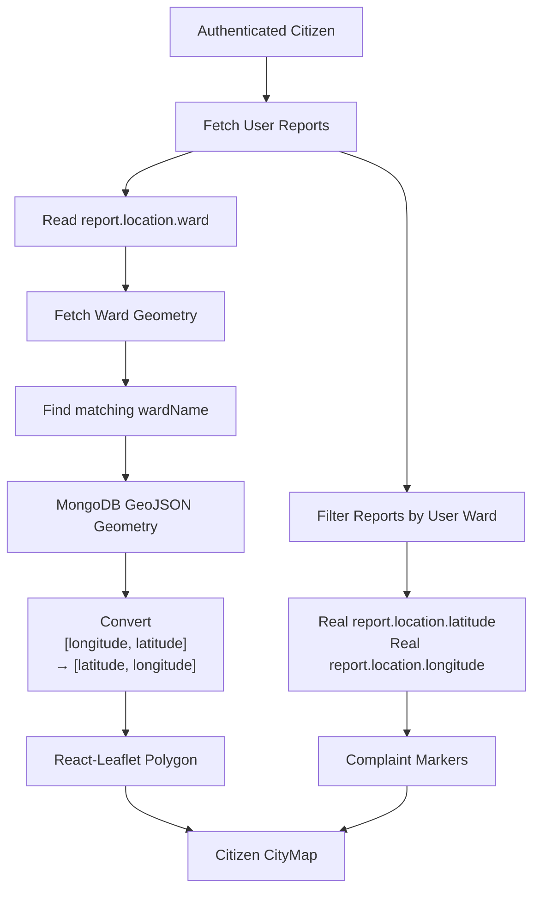
```mermaid
flowchart TD
    LOGIN["Authenticated Citizen"]
        --> REPORTS["Fetch User Reports"]

    REPORTS --> WARD_NAME["Read report.location.ward"]

    WARD_NAME --> WARD_API["Fetch Ward Geometry"]

    WARD_API --> MATCH["Find matching wardName"]

    MATCH --> GEOJSON["MongoDB GeoJSON Geometry"]

    GEOJSON --> CONVERT["Convert<br/>[longitude, latitude]<br/>→ [latitude, longitude]"]

    CONVERT --> POLYGON["React-Leaflet Polygon"]

    REPORTS --> FILTER["Filter Reports by User Ward"]

    FILTER --> GPS["Real report.location.latitude<br/>Real report.location.longitude"]

    GPS --> MARKERS["Complaint Markers"]

    POLYGON --> MAP["Citizen CityMap"]
    MARKERS --> MAP
```

---

## Authentication Flow

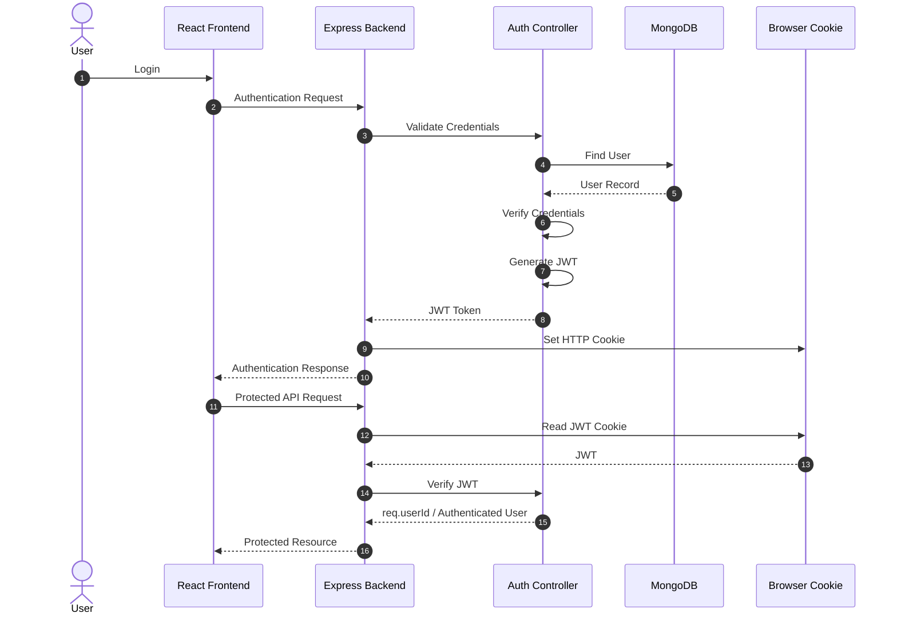
```mermaid
sequenceDiagram
    autonumber

    actor User as User
    participant FE as React Frontend
    participant BE as Express Backend
    participant AUTH as Auth Controller
    participant DB as MongoDB
    participant COOKIE as Browser Cookie

    User->>FE: Login
    FE->>BE: Authentication Request

    BE->>AUTH: Validate Credentials

    AUTH->>DB: Find User
    DB-->>AUTH: User Record

    AUTH->>AUTH: Verify Credentials

    AUTH->>AUTH: Generate JWT

    AUTH-->>BE: JWT Token

    BE->>COOKIE: Set HTTP Cookie
    BE-->>FE: Authentication Response

    FE->>BE: Protected API Request

    BE->>COOKIE: Read JWT Cookie
    COOKIE-->>BE: JWT

    BE->>AUTH: Verify JWT

    AUTH-->>BE: req.userId / Authenticated User

    BE-->>FE: Protected Resource
```

---

## Google Authentication Flow

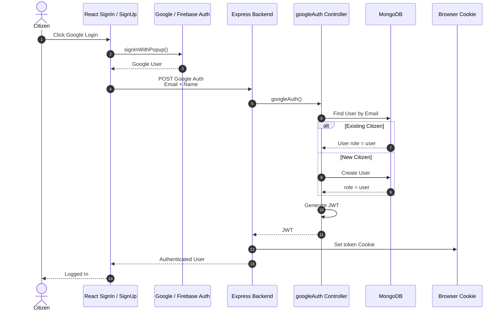
```mermaid
sequenceDiagram
    autonumber

    actor User as Citizen
    participant FE as React SignIn / SignUp
    participant GOOGLE as Google / Firebase Auth
    participant BE as Express Backend
    participant AUTH as googleAuth Controller
    participant DB as MongoDB
    participant COOKIE as Browser Cookie

    User->>FE: Click Google Login

    FE->>GOOGLE: signInWithPopup()
    GOOGLE-->>FE: Google User

    FE->>BE: POST Google Auth<br/>Email + Name

    BE->>AUTH: googleAuth()

    AUTH->>DB: Find User by Email

    alt Existing Citizen
        DB-->>AUTH: User role = user
    else New Citizen
        AUTH->>DB: Create User
        DB-->>AUTH: role = user
    end

    AUTH->>AUTH: Generate JWT

    AUTH-->>BE: JWT

    BE->>COOKIE: Set token Cookie

    BE-->>FE: Authenticated User

    FE-->>User: Logged In
```

---

## Image Upload Flow

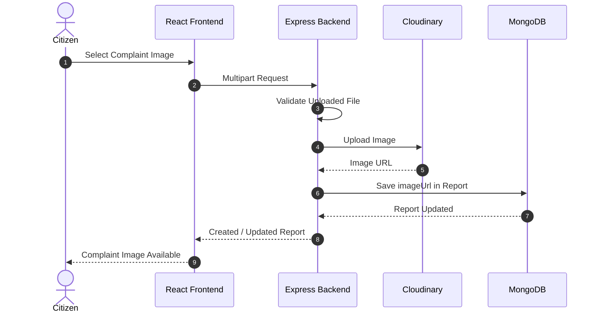
```mermaid
sequenceDiagram
    autonumber

    actor Citizen as Citizen
    participant FE as React Frontend
    participant BE as Express Backend
    participant CLOUD as Cloudinary
    participant DB as MongoDB

    Citizen->>FE: Select Complaint Image

    FE->>BE: Multipart Request

    BE->>BE: Validate Uploaded File

    BE->>CLOUD: Upload Image

    CLOUD-->>BE: Image URL

    BE->>DB: Save imageUrl in Report

    DB-->>BE: Report Updated

    BE-->>FE: Created / Updated Report

    FE-->>Citizen: Complaint Image Available
```

---

## Database Architecture & ER Diagram

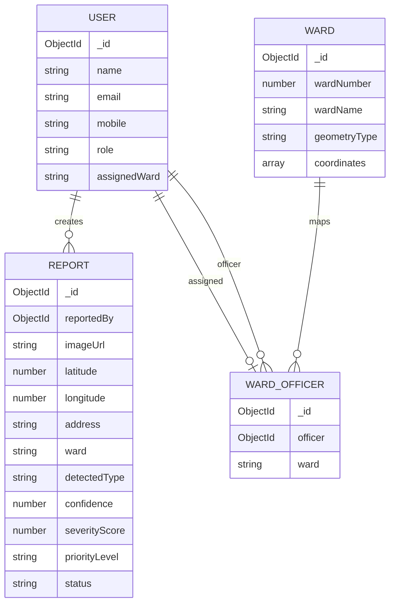
```mermaid
erDiagram
    USER ||--o{ REPORT : creates
    USER ||--o| WARD_OFFICER : assigned
    WARD ||--o{ WARD_OFFICER : maps
    WARD_OFFICER }o--|| USER : officer

    USER {
        ObjectId _id
        string name
        string email
        string mobile
        string role
        string assignedWard
    }

    REPORT {
        ObjectId _id
        ObjectId reportedBy
        string imageUrl
        number latitude
        number longitude
        string address
        string ward
        string detectedType
        number confidence
        number severityScore
        string priorityLevel
        string status
    }

    WARD {
        ObjectId _id
        number wardNumber
        string wardName
        string geometryType
        array coordinates
    }

    WARD_OFFICER {
        ObjectId _id
        ObjectId officer
        string ward
    }
```

---

## Ward & Geospatial Architecture

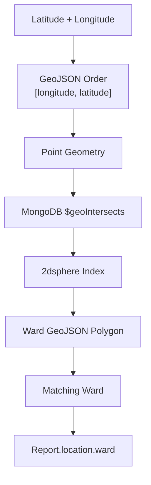
```mermaid
flowchart TD
    GPS["Latitude + Longitude"]
        --> ORDER["GeoJSON Order<br/>[longitude, latitude]"]

    ORDER --> POINT["Point Geometry"]

    POINT --> QUERY["MongoDB $geoIntersects"]

    QUERY --> INDEX["2dsphere Index"]

    INDEX --> GEOMETRY["Ward GeoJSON Polygon"]

    GEOMETRY --> MATCH["Matching Ward"]

    MATCH --> REPORT["Report.location.ward"]
```

---

## Notification Architecture

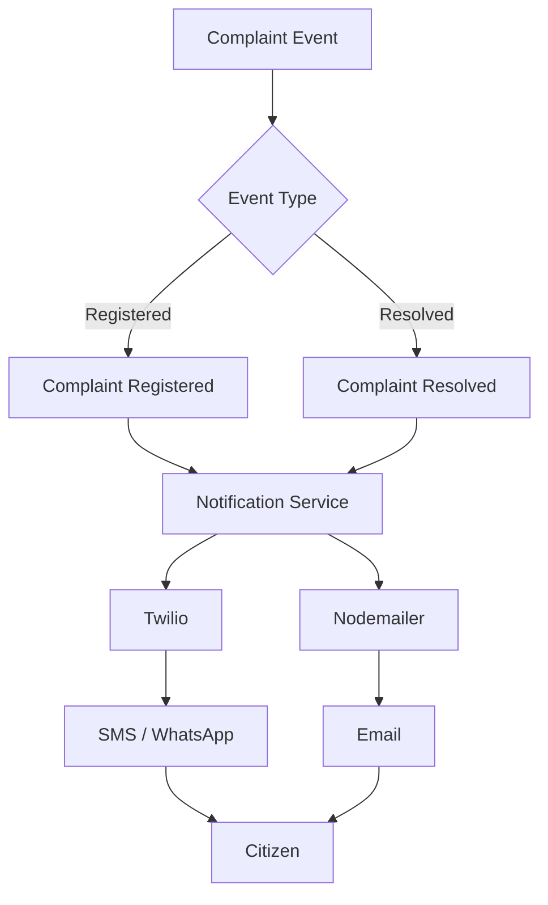
```mermaid
flowchart TD
    EVENT["Complaint Event"]

    EVENT --> REGISTER{"Event Type"}

    REGISTER -- Registered --> REG["Complaint Registered"]
    REGISTER -- Resolved --> RES["Complaint Resolved"]

    REG --> SERVICE["Notification Service"]
    RES --> SERVICE

    SERVICE --> TWILIO["Twilio"]
    SERVICE --> EMAIL["Nodemailer"]

    TWILIO --> SMS["SMS / WhatsApp"]
    EMAIL --> MAIL["Email"]

    SMS --> USER["Citizen"]
    MAIL --> USER
```

---

## API Architecture

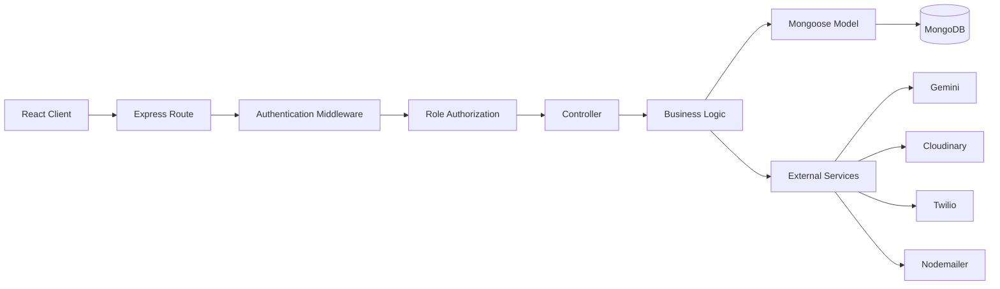
```mermaid
flowchart LR
    CLIENT["React Client"]
        --> ROUTE["Express Route"]

    ROUTE --> AUTH["Authentication Middleware"]

    AUTH --> ROLE["Role Authorization"]

    ROLE --> CONTROLLER["Controller"]

    CONTROLLER --> SERVICE["Business Logic"]

    SERVICE --> MODEL["Mongoose Model"]

    MODEL --> DB[("MongoDB")]

    SERVICE --> EXTERNAL["External Services"]

    EXTERNAL --> GEMINI["Gemini"]
    EXTERNAL --> CLOUDINARY["Cloudinary"]
    EXTERNAL --> TWILIO["Twilio"]
    EXTERNAL --> EMAIL["Nodemailer"]
```

---

## Frontend Architecture

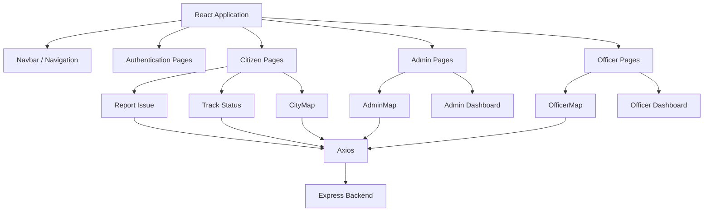
```mermaid
flowchart TD
    APP["React Application"]

    APP --> NAV["Navbar / Navigation"]

    APP --> AUTH_PAGES["Authentication Pages"]

    APP --> CITIZEN["Citizen Pages"]

    APP --> ADMIN["Admin Pages"]

    APP --> OFFICER["Officer Pages"]

    CITIZEN --> REPORT_PAGE["Report Issue"]
    CITIZEN --> TRACK["Track Status"]
    CITIZEN --> CITYMAP["CityMap"]

    ADMIN --> ADMIN_MAP["AdminMap"]
    ADMIN --> ADMIN_DASH["Admin Dashboard"]

    OFFICER --> OFFICER_MAP["OfficerMap"]
    OFFICER --> OFFICER_DASH["Officer Dashboard"]

    CITYMAP --> API["Axios"]
    ADMIN_MAP --> API
    OFFICER_MAP --> API
    REPORT_PAGE --> API
    TRACK --> API

    API --> BACKEND["Express Backend"]
```

---

## Security & Authorization Flow

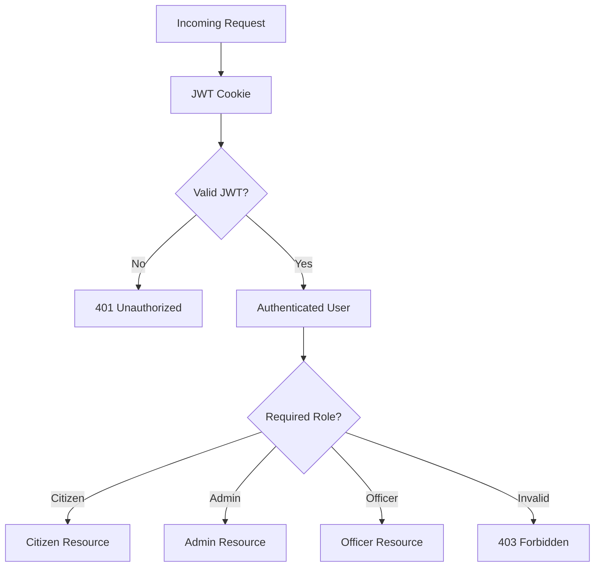
```mermaid
flowchart TD
    REQUEST["Incoming Request"]
        --> COOKIE["JWT Cookie"]

    COOKIE --> VALID{"Valid JWT?"}

    VALID -- No --> UNAUTH["401 Unauthorized"]

    VALID -- Yes --> USER["Authenticated User"]

    USER --> ROLE{"Required Role?"}

    ROLE -- Citizen --> CITIZEN["Citizen Resource"]
    ROLE -- Admin --> ADMIN["Admin Resource"]
    ROLE -- Officer --> OFFICER["Officer Resource"]

    ROLE -- Invalid --> FORBIDDEN["403 Forbidden"]
```

---

## Complete End-to-End Sequence

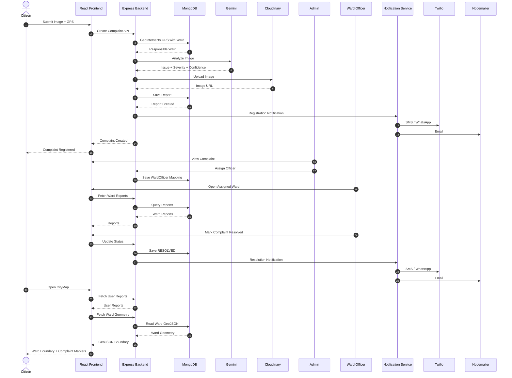
```mermaid
sequenceDiagram
    autonumber

    actor C as Citizen
    participant F as React Frontend
    participant B as Express Backend
    participant M as MongoDB
    participant G as Gemini
    participant CL as Cloudinary
    participant A as Admin
    participant O as Ward Officer
    participant N as Notification Service
    participant T as Twilio
    participant E as Nodemailer

    C->>F: Submit image + GPS
    F->>B: Create Complaint API

    B->>M: GeoIntersects GPS with Ward
    M-->>B: Responsible Ward

    B->>G: Analyze Image
    G-->>B: Issue + Severity + Confidence

    B->>CL: Upload Image
    CL-->>B: Image URL

    B->>M: Save Report
    M-->>B: Report Created

    B->>N: Registration Notification
    N->>T: SMS / WhatsApp
    N->>E: Email

    B-->>F: Complaint Created
    F-->>C: Complaint Registered

    A->>F: View Complaint
    A->>B: Assign Officer
    B->>M: Save WardOfficer Mapping

    O->>F: Open Assigned Ward
    F->>B: Fetch Ward Reports
    B->>M: Query Reports
    M-->>B: Ward Reports
    B-->>F: Reports

    O->>F: Mark Complaint Resolved
    F->>B: Update Status
    B->>M: Save RESOLVED

    B->>N: Resolution Notification
    N->>T: SMS / WhatsApp
    N->>E: Email

    C->>F: Open CityMap
    F->>B: Fetch User Reports
    B-->>F: User Reports

    F->>B: Fetch Ward Geometry
    B->>M: Read Ward GeoJSON
    M-->>B: Ward Geometry
    B-->>F: GeoJSON Boundary

    F-->>C: Ward Boundary + Complaint Markers
```

---

## API Reference

### Authentication APIs (`/api/auth`)
- `POST /api/auth/signup`: Register citizen account.
- `POST /api/auth/signin`: Authenticate user credentials (returns JWT cookie).
- `POST /api/auth/google-auth`: Authenticate/register citizen via Google OAuth.
- `POST /api/auth/signout`: Clear HTTP-only authentication cookie.
- `POST /api/auth/send-otp`: Trigger password reset OTP email.
- `POST /api/auth/verify-otp`: Verify 6-digit OTP code.
- `POST /api/auth/reset-password`: Update password.

### Report APIs (`/report/report-submit`)
- `POST /report/report-submit/report`: Submit complaint photo + GPS location (`isAuth`).
- `GET /report/report-submit/reports`: Fetch logged-in user's submitted complaints (`isAuth`).

### Admin & Officer APIs (`/api/admin`)
- `GET /api/admin/wards`: Fetch all municipal ward GeoJSON documents (`isAuth`).
- `GET /api/admin/reports`: Fetch all complaints across all wards (`isAdmin`).
- `PATCH /api/admin/reports/:id/status`: Update complaint status (`isAdminOrOfficer`).
- `GET /api/admin/ward-summary`: Ward complaint metrics (`isAdmin`).
- `POST /api/admin/ward-officer`: Assign officer to ward (`isAdmin`).
- `GET /api/admin/officer/reports`: Fetch complaints for officer's assigned ward (`isAdminOrOfficer`).

---

## Project Structure

```
Faultline-AI/
├── frontend/
│   ├── src/
│   │   ├── components/
│   │   │   └── Navbar.jsx
│   │   ├── pages/
│   │   │   ├── AdminIssues.jsx
│   │   │   ├── AdminMap.jsx
│   │   │   ├── CityMap.jsx
│   │   │   ├── ForgetPassword.jsx
│   │   │   ├── Home.jsx
│   │   │   ├── OfficerIssues.jsx
│   │   │   ├── OfficerMap.jsx
│   │   │   ├── Report.jsx
│   │   │   ├── SignIn.jsx
│   │   │   ├── SignUp.jsx
│   │   │   └── TrackStatus.jsx
│   │   ├── redux/
│   │   │   ├── store.js
│   │   │   └── userSlice.js
│   │   ├── utils/
│   │   │   └── wardPolygon.js
│   │   ├── App.jsx
│   │   └── firebase.js
│   ├── package.json
│   └── vite.config.js
│
├── backend/
│   ├── config/
│   │   ├── db.js
│   │   └── seedWards.js
│   ├── controllers/
│   │   ├── adminController.js
│   │   ├── authController.js
│   │   └── reportController.js
│   ├── middleware/
│   │   ├── isAdmin.js
│   │   ├── isAuth.js
│   │   └── multer.js
│   ├── model/
│   │   ├── Report.js
│   │   ├── User.js
│   │   ├── Ward.js
│   │   └── WardOfficer.js
│   ├── routes/
│   │   ├── adminRoute.js
│   │   ├── authRoute.js
│   │   ├── reportRoute.js
│   │   └── userRoute.js
│   ├── utils/
│   │   ├── cloudinary.js
│   │   ├── nodemailer.js
│   │   ├── notificationService.js
│   │   └── twillio.js
│   ├── index.js
│   └── package.json
│
└── README.md
```

---

## Environment Variables

Create a `.env` file in the `backend/` directory:

```env
# Server & Database Configuration
PORT=8000
MONGODB_URI=mongodb://127.0.0.1:27017/faultlineAi
JWT_SECRET=your_super_secret_jwt_key

# Artificial Intelligence (Google Gemini)
GEMINI_API_KEY=your_google_gemini_api_key

# Media Storage (Cloudinary)
MY_CLOUD_NAME=your_cloudinary_cloud_name
MY_API_KEY=your_cloudinary_api_key
MY_CLOUD_SECRET=your_cloudinary_api_secret

# Multi-Channel Notifications
EMAIL=your_gmail_address@gmail.com
PASS=your_gmail_app_password

TWILIO_ACCOUNT_SID=your_twilio_account_sid
TWILIO_AUTH_TOKEN=your_twilio_auth_token
TWILIO_PHONE_NUMBER=your_twilio_phone_number
```

---

## Local Development Setup

### 1. Backend Setup
```bash
cd backend
npm install
# Configure backend/.env file
npm start
```
*The backend automatically seeds the 12 official VMC municipal ward polygons + Test Ward #99 on startup.*

### 2. Frontend Setup
```bash
cd frontend
npm install
npm run dev
```
*Access application in browser at `http://localhost:5173`.*

---

## Build & Deployment

```bash
cd frontend
npm run build
```
- **Build Output**: `frontend/dist/`
- **Compiler**: Vite v7
- **Verification**: Zero compilation errors.

---

## Important Design Decisions

1. **Backend Authoritative Ward Assignment**: GPS coordinates are converted into GeoJSON `Point` and queried against stored ward geometries using `$geoIntersects`. The client cannot choose or spoof municipal wards.
2. **Standardized Coordinates**: Stored as `[longitude, latitude]` for MongoDB 2dsphere indexing and dynamically converted to `[latitude, longitude]` for Leaflet maps.
3. **Non-Blocking Notifications**: Twilio and Nodemailer dispatch asynchronously to ensure network/gateway timeouts do not block database transactions.
4. **Authentic Ward Geometries**: Uses the official multi-vertex GeoJSON dataset derived from BharatAtlas/DataMeet.

---

## Data Sources

- **Vadodara Administrative Ward Boundaries**: Derived from the open-source **BharatAtlas / DataMeet** Vadodara Ward Map dataset (`https://bharatlas.com/view/wards_vadodara`), licensed under CC-BY-4.0.

---

## How to Explain This Project in an Interview

> *"Faultline AI is a role-based civic management platform built with React, Node.js, Express, and MongoDB. The core technical achievement is its backend-authoritative geospatial engine: when a citizen submits an issue with GPS coordinates, MongoDB uses a 2dsphere $geoIntersects query to map the coordinates against stored GeoJSON ward polygons to determine the municipal ward. Uploaded photos are processed asynchronously by Google Gemini AI to analyze issue type and severity score. The workflow manages issue resolution across Municipal Admin and Ward Officer dashboards, sending real-time SMS and email notifications to citizens upon registration and resolution."*

---

## Future Improvements

- [ ] Spatial radius duplicate complaint detection ($100\text{m}$).
- [ ] Citizen upvoting & priority endorsement.
- [ ] Real-time WebSocket notifications for ward officers.
- [ ] Public municipal resolution performance dashboard.

---

### License & Attribution
Maintained by **Ravindra Prajapat** — [faultline-ai Repository](https://github.com/Ravindraprajapat/faultline-ai).
